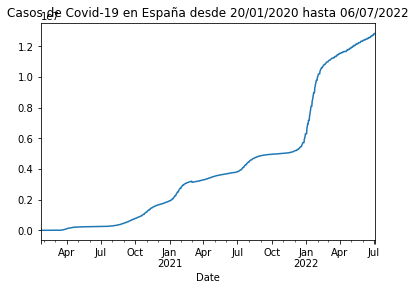
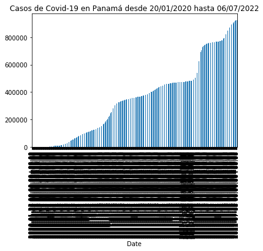

# AD3: conexión con la API del COVID-19 y análisis con Pandas

Me conecto a la API https://api.covid19api.com/

## Instalación e importación de Pandas


```python
!pip install pandas
```

    Requirement already satisfied: pandas in c:\users\rnasa\anaconda3\lib\site-packages (0.25.1)
    Requirement already satisfied: python-dateutil>=2.6.1 in c:\users\rnasa\anaconda3\lib\site-packages (from pandas) (2.8.0)
    Requirement already satisfied: numpy>=1.13.3 in c:\users\rnasa\anaconda3\lib\site-packages (from pandas) (1.16.5)
    Requirement already satisfied: pytz>=2017.2 in c:\users\rnasa\anaconda3\lib\site-packages (from pandas) (2019.3)
    Requirement already satisfied: six>=1.5 in c:\users\rnasa\anaconda3\lib\site-packages (from python-dateutil>=2.6.1->pandas) (1.12.0)
    


```python
import pandas as pd
```

## Variables/objetos

Variable de nombre `url` para llamar a la lista de diccionarios de países de la API del Covid-19. Posteriormente invoco la url para saber si ha funcionado la llamada.


```python
url = 'https://api.covid19api.com/countries'
```


```python
url
```


    'https://api.covid19api.com/countries'


Añado una variable para la función `pd.read_json` para la variable anterior.

Se podría hacer:

`df = pd.read_json(https://api.covid19api.com/countries`

Se hace a través de variable para facilitar su uso posterior con código más breve.

Posteriormente invoco el datajson para ver si ha funcionado la importación, lo que muestra una tabla en la que hay 248 elementos. En este caso empieza a contar en 0 por tratarse de json. 

Este código nos muestra un estracto con las filas del inicio y las del final.


```python
df = pd.read_json(url)
```


```python
df
```


<div>
<style scoped>
    .dataframe tbody tr th:only-of-type {
        vertical-align: middle;
    }

    .dataframe tbody tr th {
        vertical-align: top;
    }

    .dataframe thead th {
        text-align: right;
    }
</style>
<table border="1" class="dataframe">
  <thead>
    <tr style="text-align: right;">
      <th></th>
      <th>Country</th>
      <th>Slug</th>
      <th>ISO2</th>
    </tr>
  </thead>
  <tbody>
    <tr>
      <td>0</td>
      <td>Gibraltar</td>
      <td>gibraltar</td>
      <td>GI</td>
    </tr>
    <tr>
      <td>1</td>
      <td>Oman</td>
      <td>oman</td>
      <td>OM</td>
    </tr>
    <tr>
      <td>2</td>
      <td>France</td>
      <td>france</td>
      <td>FR</td>
    </tr>
    <tr>
      <td>3</td>
      <td>Jersey</td>
      <td>jersey</td>
      <td>JE</td>
    </tr>
    <tr>
      <td>4</td>
      <td>Mali</td>
      <td>mali</td>
      <td>ML</td>
    </tr>
    <tr>
      <td>...</td>
      <td>...</td>
      <td>...</td>
      <td>...</td>
    </tr>
    <tr>
      <td>243</td>
      <td>Puerto Rico</td>
      <td>puerto-rico</td>
      <td>PR</td>
    </tr>
    <tr>
      <td>244</td>
      <td>Papua New Guinea</td>
      <td>papua-new-guinea</td>
      <td>PG</td>
    </tr>
    <tr>
      <td>245</td>
      <td>Saint Pierre and Miquelon</td>
      <td>saint-pierre-and-miquelon</td>
      <td>PM</td>
    </tr>
    <tr>
      <td>246</td>
      <td>Timor-Leste</td>
      <td>timor-leste</td>
      <td>TL</td>
    </tr>
    <tr>
      <td>247</td>
      <td>Montenegro</td>
      <td>montenegro</td>
      <td>ME</td>
    </tr>
  </tbody>
</table>
<p>248 rows × 3 columns</p>
</div>


Para visualizar los datos de España, dado que tengo una columna de países, creo una lista nueva que seleccione solo los identificadores similares a `Spain`.


```python
df[df['Country'] == 'Spain']
```


<div>
<style scoped>
    .dataframe tbody tr th:only-of-type {
        vertical-align: middle;
    }

    .dataframe tbody tr th {
        vertical-align: top;
    }

    .dataframe thead th {
        text-align: right;
    }
</style>
<table border="1" class="dataframe">
  <thead>
    <tr style="text-align: right;">
      <th></th>
      <th>Country</th>
      <th>Slug</th>
      <th>ISO2</th>
    </tr>
  </thead>
  <tbody>
    <tr>
      <td>141</td>
      <td>Spain</td>
      <td>spain</td>
      <td>ES</td>
    </tr>
  </tbody>
</table>
</div>


Defino otra variable con los datos en tiempo real de España.
(¡ATENCIÓN! la nomenclatura con guion bajo, ya que el guion medio no debe emplearse para código de este tipo).

Creo el objeto `df_rt_es` para que lea la información de la url previa.

Posteriormente muestro los datos para ver que ha funcionado correctamente.


```python
url_rt_es = 'https://api.covid19api.com/country/spain/status/confirmed/live'
df_rt_es = pd.read_json(url_rt_es)
df_rt_es
```


<div>
<style scoped>
    .dataframe tbody tr th:only-of-type {
        vertical-align: middle;
    }

    .dataframe tbody tr th {
        vertical-align: top;
    }

    .dataframe thead th {
        text-align: right;
    }
</style>
<table border="1" class="dataframe">
  <thead>
    <tr style="text-align: right;">
      <th></th>
      <th>Country</th>
      <th>CountryCode</th>
      <th>Province</th>
      <th>City</th>
      <th>CityCode</th>
      <th>Lat</th>
      <th>Lon</th>
      <th>Cases</th>
      <th>Status</th>
      <th>Date</th>
    </tr>
  </thead>
  <tbody>
    <tr>
      <td>0</td>
      <td>Spain</td>
      <td>ES</td>
      <td></td>
      <td></td>
      <td></td>
      <td>40.46</td>
      <td>-3.75</td>
      <td>0</td>
      <td>confirmed</td>
      <td>2020-01-22 00:00:00+00:00</td>
    </tr>
    <tr>
      <td>1</td>
      <td>Spain</td>
      <td>ES</td>
      <td></td>
      <td></td>
      <td></td>
      <td>40.46</td>
      <td>-3.75</td>
      <td>0</td>
      <td>confirmed</td>
      <td>2020-01-23 00:00:00+00:00</td>
    </tr>
    <tr>
      <td>2</td>
      <td>Spain</td>
      <td>ES</td>
      <td></td>
      <td></td>
      <td></td>
      <td>40.46</td>
      <td>-3.75</td>
      <td>0</td>
      <td>confirmed</td>
      <td>2020-01-24 00:00:00+00:00</td>
    </tr>
    <tr>
      <td>3</td>
      <td>Spain</td>
      <td>ES</td>
      <td></td>
      <td></td>
      <td></td>
      <td>40.46</td>
      <td>-3.75</td>
      <td>0</td>
      <td>confirmed</td>
      <td>2020-01-25 00:00:00+00:00</td>
    </tr>
    <tr>
      <td>4</td>
      <td>Spain</td>
      <td>ES</td>
      <td></td>
      <td></td>
      <td></td>
      <td>40.46</td>
      <td>-3.75</td>
      <td>0</td>
      <td>confirmed</td>
      <td>2020-01-26 00:00:00+00:00</td>
    </tr>
    <tr>
      <td>...</td>
      <td>...</td>
      <td>...</td>
      <td>...</td>
      <td>...</td>
      <td>...</td>
      <td>...</td>
      <td>...</td>
      <td>...</td>
      <td>...</td>
      <td>...</td>
    </tr>
    <tr>
      <td>891</td>
      <td>Spain</td>
      <td>ES</td>
      <td></td>
      <td></td>
      <td></td>
      <td>40.46</td>
      <td>-3.75</td>
      <td>12818184</td>
      <td>confirmed</td>
      <td>2022-07-01 00:00:00+00:00</td>
    </tr>
    <tr>
      <td>892</td>
      <td>Spain</td>
      <td>ES</td>
      <td></td>
      <td></td>
      <td></td>
      <td>40.46</td>
      <td>-3.75</td>
      <td>12818184</td>
      <td>confirmed</td>
      <td>2022-07-02 00:00:00+00:00</td>
    </tr>
    <tr>
      <td>893</td>
      <td>Spain</td>
      <td>ES</td>
      <td></td>
      <td></td>
      <td></td>
      <td>40.46</td>
      <td>-3.75</td>
      <td>12818184</td>
      <td>confirmed</td>
      <td>2022-07-03 00:00:00+00:00</td>
    </tr>
    <tr>
      <td>894</td>
      <td>Spain</td>
      <td>ES</td>
      <td></td>
      <td></td>
      <td></td>
      <td>40.46</td>
      <td>-3.75</td>
      <td>12818184</td>
      <td>confirmed</td>
      <td>2022-07-04 00:00:00+00:00</td>
    </tr>
    <tr>
      <td>895</td>
      <td>Spain</td>
      <td>ES</td>
      <td></td>
      <td></td>
      <td></td>
      <td>40.46</td>
      <td>-3.75</td>
      <td>12890002</td>
      <td>confirmed</td>
      <td>2022-07-05 00:00:00+00:00</td>
    </tr>
  </tbody>
</table>
<p>896 rows × 10 columns</p>
</div>


Marco `df_rt_es.tail()` para ver la cola de la tabla.


```python
df_rt_es.tail()
```


<div>
<style scoped>
    .dataframe tbody tr th:only-of-type {
        vertical-align: middle;
    }

    .dataframe tbody tr th {
        vertical-align: top;
    }

    .dataframe thead th {
        text-align: right;
    }
</style>
<table border="1" class="dataframe">
  <thead>
    <tr style="text-align: right;">
      <th></th>
      <th>Country</th>
      <th>CountryCode</th>
      <th>Province</th>
      <th>City</th>
      <th>CityCode</th>
      <th>Lat</th>
      <th>Lon</th>
      <th>Cases</th>
      <th>Status</th>
      <th>Date</th>
    </tr>
  </thead>
  <tbody>
    <tr>
      <td>891</td>
      <td>Spain</td>
      <td>ES</td>
      <td></td>
      <td></td>
      <td></td>
      <td>40.46</td>
      <td>-3.75</td>
      <td>12818184</td>
      <td>confirmed</td>
      <td>2022-07-01 00:00:00+00:00</td>
    </tr>
    <tr>
      <td>892</td>
      <td>Spain</td>
      <td>ES</td>
      <td></td>
      <td></td>
      <td></td>
      <td>40.46</td>
      <td>-3.75</td>
      <td>12818184</td>
      <td>confirmed</td>
      <td>2022-07-02 00:00:00+00:00</td>
    </tr>
    <tr>
      <td>893</td>
      <td>Spain</td>
      <td>ES</td>
      <td></td>
      <td></td>
      <td></td>
      <td>40.46</td>
      <td>-3.75</td>
      <td>12818184</td>
      <td>confirmed</td>
      <td>2022-07-03 00:00:00+00:00</td>
    </tr>
    <tr>
      <td>894</td>
      <td>Spain</td>
      <td>ES</td>
      <td></td>
      <td></td>
      <td></td>
      <td>40.46</td>
      <td>-3.75</td>
      <td>12818184</td>
      <td>confirmed</td>
      <td>2022-07-04 00:00:00+00:00</td>
    </tr>
    <tr>
      <td>895</td>
      <td>Spain</td>
      <td>ES</td>
      <td></td>
      <td></td>
      <td></td>
      <td>40.46</td>
      <td>-3.75</td>
      <td>12890002</td>
      <td>confirmed</td>
      <td>2022-07-05 00:00:00+00:00</td>
    </tr>
  </tbody>
</table>
</div>


Marco `df_rt_es.head()` para ver la parte inicial.


```python
df_rt_es.head()
```


<div>
<style scoped>
    .dataframe tbody tr th:only-of-type {
        vertical-align: middle;
    }

    .dataframe tbody tr th {
        vertical-align: top;
    }

    .dataframe thead th {
        text-align: right;
    }
</style>
<table border="1" class="dataframe">
  <thead>
    <tr style="text-align: right;">
      <th></th>
      <th>Country</th>
      <th>CountryCode</th>
      <th>Province</th>
      <th>City</th>
      <th>CityCode</th>
      <th>Lat</th>
      <th>Lon</th>
      <th>Cases</th>
      <th>Status</th>
      <th>Date</th>
    </tr>
  </thead>
  <tbody>
    <tr>
      <td>0</td>
      <td>Spain</td>
      <td>ES</td>
      <td></td>
      <td></td>
      <td></td>
      <td>40.46</td>
      <td>-3.75</td>
      <td>0</td>
      <td>confirmed</td>
      <td>2020-01-22 00:00:00+00:00</td>
    </tr>
    <tr>
      <td>1</td>
      <td>Spain</td>
      <td>ES</td>
      <td></td>
      <td></td>
      <td></td>
      <td>40.46</td>
      <td>-3.75</td>
      <td>0</td>
      <td>confirmed</td>
      <td>2020-01-23 00:00:00+00:00</td>
    </tr>
    <tr>
      <td>2</td>
      <td>Spain</td>
      <td>ES</td>
      <td></td>
      <td></td>
      <td></td>
      <td>40.46</td>
      <td>-3.75</td>
      <td>0</td>
      <td>confirmed</td>
      <td>2020-01-24 00:00:00+00:00</td>
    </tr>
    <tr>
      <td>3</td>
      <td>Spain</td>
      <td>ES</td>
      <td></td>
      <td></td>
      <td></td>
      <td>40.46</td>
      <td>-3.75</td>
      <td>0</td>
      <td>confirmed</td>
      <td>2020-01-25 00:00:00+00:00</td>
    </tr>
    <tr>
      <td>4</td>
      <td>Spain</td>
      <td>ES</td>
      <td></td>
      <td></td>
      <td></td>
      <td>40.46</td>
      <td>-3.75</td>
      <td>0</td>
      <td>confirmed</td>
      <td>2020-01-26 00:00:00+00:00</td>
    </tr>
  </tbody>
</table>
</div>


Tenemos una tabla con columnas para ID, país, código de país, provincia, ciudad, código de ciudad, latitud, longitud, número de casos, estado y la fecha. Si quiero obtener una gráfica con el número de casos y la fecha lo que debo hacer es transformar la columna de control. Para ello convierto la columna de fecha en columna de control pidiéndole ya que me muestre los casos España desde el 20 de enero de 2020 a la actualidad con la expresión `df_rt_es.set_index('Date')['Cases'].plot(title="Casos de Covid-19 en España desde 20/01/2020 hasta 29/06/2022")` a la que debo darle un nombre de variable si no quiero tener problemas con la configuración de Anaconda3. Le ponto de nombre `plot_rt_es`.


```python
plot_rt_es = df_rt_es.set_index('Date')['Cases'].plot(title="Casos de Covid-19 en España desde 20/01/2020 hasta 06/07/2022")
```





## Repetir el proceso para Panamá
Llevo a cabo el mismo código de variables, pero para la URL de Panamá.


```python
df[df['Country'] == 'Panama']
```


<div>
<style scoped>
    .dataframe tbody tr th:only-of-type {
        vertical-align: middle;
    }

    .dataframe tbody tr th {
        vertical-align: top;
    }

    .dataframe thead th {
        text-align: right;
    }
</style>
<table border="1" class="dataframe">
  <thead>
    <tr style="text-align: right;">
      <th></th>
      <th>Country</th>
      <th>Slug</th>
      <th>ISO2</th>
    </tr>
  </thead>
  <tbody>
    <tr>
      <td>190</td>
      <td>Panama</td>
      <td>panama</td>
      <td>PA</td>
    </tr>
  </tbody>
</table>
</div>


```python
url_rt_pa = 'https://api.covid19api.com/country/panama/status/confirmed/live'
```


```python
url_rt_pa
```


    'https://api.covid19api.com/country/panama/status/confirmed/live'


```python
df_rt_pa = pd.read_json(url_rt_pa)
```


```python
df_rt_pa
```


<div>
<style scoped>
    .dataframe tbody tr th:only-of-type {
        vertical-align: middle;
    }

    .dataframe tbody tr th {
        vertical-align: top;
    }

    .dataframe thead th {
        text-align: right;
    }
</style>
<table border="1" class="dataframe">
  <thead>
    <tr style="text-align: right;">
      <th></th>
      <th>Country</th>
      <th>CountryCode</th>
      <th>Province</th>
      <th>City</th>
      <th>CityCode</th>
      <th>Lat</th>
      <th>Lon</th>
      <th>Cases</th>
      <th>Status</th>
      <th>Date</th>
    </tr>
  </thead>
  <tbody>
    <tr>
      <td>0</td>
      <td>Panama</td>
      <td>PA</td>
      <td></td>
      <td></td>
      <td></td>
      <td>8.54</td>
      <td>-80.78</td>
      <td>0</td>
      <td>confirmed</td>
      <td>2020-01-22 00:00:00+00:00</td>
    </tr>
    <tr>
      <td>1</td>
      <td>Panama</td>
      <td>PA</td>
      <td></td>
      <td></td>
      <td></td>
      <td>8.54</td>
      <td>-80.78</td>
      <td>0</td>
      <td>confirmed</td>
      <td>2020-01-23 00:00:00+00:00</td>
    </tr>
    <tr>
      <td>2</td>
      <td>Panama</td>
      <td>PA</td>
      <td></td>
      <td></td>
      <td></td>
      <td>8.54</td>
      <td>-80.78</td>
      <td>0</td>
      <td>confirmed</td>
      <td>2020-01-24 00:00:00+00:00</td>
    </tr>
    <tr>
      <td>3</td>
      <td>Panama</td>
      <td>PA</td>
      <td></td>
      <td></td>
      <td></td>
      <td>8.54</td>
      <td>-80.78</td>
      <td>0</td>
      <td>confirmed</td>
      <td>2020-01-25 00:00:00+00:00</td>
    </tr>
    <tr>
      <td>4</td>
      <td>Panama</td>
      <td>PA</td>
      <td></td>
      <td></td>
      <td></td>
      <td>8.54</td>
      <td>-80.78</td>
      <td>0</td>
      <td>confirmed</td>
      <td>2020-01-26 00:00:00+00:00</td>
    </tr>
    <tr>
      <td>...</td>
      <td>...</td>
      <td>...</td>
      <td>...</td>
      <td>...</td>
      <td>...</td>
      <td>...</td>
      <td>...</td>
      <td>...</td>
      <td>...</td>
      <td>...</td>
    </tr>
    <tr>
      <td>892</td>
      <td>Panama</td>
      <td>PA</td>
      <td></td>
      <td></td>
      <td></td>
      <td>8.54</td>
      <td>-80.78</td>
      <td>922990</td>
      <td>confirmed</td>
      <td>2022-07-02 00:00:00+00:00</td>
    </tr>
    <tr>
      <td>893</td>
      <td>Panama</td>
      <td>PA</td>
      <td></td>
      <td></td>
      <td></td>
      <td>8.54</td>
      <td>-80.78</td>
      <td>925254</td>
      <td>confirmed</td>
      <td>2022-07-03 00:00:00+00:00</td>
    </tr>
    <tr>
      <td>894</td>
      <td>Panama</td>
      <td>PA</td>
      <td></td>
      <td></td>
      <td></td>
      <td>8.54</td>
      <td>-80.78</td>
      <td>925254</td>
      <td>confirmed</td>
      <td>2022-07-04 00:00:00+00:00</td>
    </tr>
    <tr>
      <td>895</td>
      <td>Panama</td>
      <td>PA</td>
      <td></td>
      <td></td>
      <td></td>
      <td>8.54</td>
      <td>-80.78</td>
      <td>925254</td>
      <td>confirmed</td>
      <td>2022-07-05 00:00:00+00:00</td>
    </tr>
    <tr>
      <td>896</td>
      <td>Panama</td>
      <td>PA</td>
      <td></td>
      <td></td>
      <td></td>
      <td>8.54</td>
      <td>-80.78</td>
      <td>925254</td>
      <td>confirmed</td>
      <td>2022-07-06 00:00:00+00:00</td>
    </tr>
  </tbody>
</table>
<p>897 rows × 10 columns</p>
</div>


```python
plot_rt_pa = df_rt_pa.set_index('Date')['Cases'].plot(title="Casos de Covid-19 en Panamá desde 20/01/2020 hasta 06/07/2022")
```


Añadiendo `,kind="area"` al final se pondría el gráfico de área y con `,kind="bar"` el gráfico de barras, aunque este formato no es lógico para este tipo de datos como puede visualizarse en el segundo ejemplo.


```python
plot_rt_pa = df_rt_pa.set_index('Date')['Cases'].plot(title="Casos de Covid-19 en Panamá desde 20/01/2020 hasta 06/07/2022",kind="area")
```


```python
plot_rt_pa = df_rt_pa.set_index('Date')['Cases'].plot(title="Casos de Covid-19 en Panamá desde 20/01/2020 hasta 06/07/2022",kind="bar")
```





## Ploteamos dos países

Para *plotear* dos o más paises hay que seguir los siguientes pasos:

Volvemos a identificar las variables previas de lectura de Json de las dos URLs para no tener que repetir el proceso desde arriba al cerrar el documento.


```python
df_rt_pa = pd.read_json(url_rt_pa)
df_rt_es = pd.read_json(url_rt_es)
```

Se separan los casos por fecha en cada uno de los países y se plotea para visualizar la gráfica.


```python
casos_pa = df_rt_pa.set_index('Date')['Cases']
casos_pa.plot(title="Casos de Covid-19 en Panamá")
```


    <matplotlib.axes._subplots.AxesSubplot at 0x1f40fd89188>


```python
casos_es = df_rt_es.set_index('Date')['Cases']
casos_pa.plot(title="Casos de Covid-19 en España")
```


    <matplotlib.axes._subplots.AxesSubplot at 0x1f41097d108>


Para visualizar podemos concatenar ambas tablas por fechas y casos en ambos países.


```python
pa_vs_es = pd.concat([casos_es,casos_pa],axis=1)
pa_vs_es
```


<div>
<style scoped>
    .dataframe tbody tr th:only-of-type {
        vertical-align: middle;
    }

    .dataframe tbody tr th {
        vertical-align: top;
    }

    .dataframe thead th {
        text-align: right;
    }
</style>
<table border="1" class="dataframe">
  <thead>
    <tr style="text-align: right;">
      <th></th>
      <th>Cases</th>
      <th>Cases</th>
    </tr>
    <tr>
      <th>Date</th>
      <th></th>
      <th></th>
    </tr>
  </thead>
  <tbody>
    <tr>
      <td>2020-01-22 00:00:00+00:00</td>
      <td>0.0</td>
      <td>0</td>
    </tr>
    <tr>
      <td>2020-01-23 00:00:00+00:00</td>
      <td>0.0</td>
      <td>0</td>
    </tr>
    <tr>
      <td>2020-01-24 00:00:00+00:00</td>
      <td>0.0</td>
      <td>0</td>
    </tr>
    <tr>
      <td>2020-01-25 00:00:00+00:00</td>
      <td>0.0</td>
      <td>0</td>
    </tr>
    <tr>
      <td>2020-01-26 00:00:00+00:00</td>
      <td>0.0</td>
      <td>0</td>
    </tr>
    <tr>
      <td>...</td>
      <td>...</td>
      <td>...</td>
    </tr>
    <tr>
      <td>2022-07-02 00:00:00+00:00</td>
      <td>12818184.0</td>
      <td>922990</td>
    </tr>
    <tr>
      <td>2022-07-03 00:00:00+00:00</td>
      <td>12818184.0</td>
      <td>925254</td>
    </tr>
    <tr>
      <td>2022-07-04 00:00:00+00:00</td>
      <td>12818184.0</td>
      <td>925254</td>
    </tr>
    <tr>
      <td>2022-07-05 00:00:00+00:00</td>
      <td>12890002.0</td>
      <td>925254</td>
    </tr>
    <tr>
      <td>2022-07-06 00:00:00+00:00</td>
      <td>NaN</td>
      <td>925254</td>
    </tr>
  </tbody>
</table>
<p>897 rows × 2 columns</p>
</div>


Para identificar los países marcamos las columnas con el nombre del país y visualizamos la gráfica con los datos nombrados.


```python
pa_vs_es.columns= ['España','Panamá']
pa_vs_es
```


<div>
<style scoped>
    .dataframe tbody tr th:only-of-type {
        vertical-align: middle;
    }

    .dataframe tbody tr th {
        vertical-align: top;
    }

    .dataframe thead th {
        text-align: right;
    }
</style>
<table border="1" class="dataframe">
  <thead>
    <tr style="text-align: right;">
      <th></th>
      <th>España</th>
      <th>Panamá</th>
    </tr>
    <tr>
      <th>Date</th>
      <th></th>
      <th></th>
    </tr>
  </thead>
  <tbody>
    <tr>
      <td>2020-01-22 00:00:00+00:00</td>
      <td>0.0</td>
      <td>0</td>
    </tr>
    <tr>
      <td>2020-01-23 00:00:00+00:00</td>
      <td>0.0</td>
      <td>0</td>
    </tr>
    <tr>
      <td>2020-01-24 00:00:00+00:00</td>
      <td>0.0</td>
      <td>0</td>
    </tr>
    <tr>
      <td>2020-01-25 00:00:00+00:00</td>
      <td>0.0</td>
      <td>0</td>
    </tr>
    <tr>
      <td>2020-01-26 00:00:00+00:00</td>
      <td>0.0</td>
      <td>0</td>
    </tr>
    <tr>
      <td>...</td>
      <td>...</td>
      <td>...</td>
    </tr>
    <tr>
      <td>2022-07-02 00:00:00+00:00</td>
      <td>12818184.0</td>
      <td>922990</td>
    </tr>
    <tr>
      <td>2022-07-03 00:00:00+00:00</td>
      <td>12818184.0</td>
      <td>925254</td>
    </tr>
    <tr>
      <td>2022-07-04 00:00:00+00:00</td>
      <td>12818184.0</td>
      <td>925254</td>
    </tr>
    <tr>
      <td>2022-07-05 00:00:00+00:00</td>
      <td>12890002.0</td>
      <td>925254</td>
    </tr>
    <tr>
      <td>2022-07-06 00:00:00+00:00</td>
      <td>NaN</td>
      <td>925254</td>
    </tr>
  </tbody>
</table>
<p>897 rows × 2 columns</p>
</div>


Posteriormente a esta concatenación le hacemos un *ploteo* para visualizar la comparativa de forma visual.


```python
pa_vs_es.plot(title="Comparativa Covid-19 España-Panamá")
```


    <matplotlib.axes._subplots.AxesSubplot at 0x1f410997848>


Si nos queremos descargar los datos en CSV podemos hacerlo con la función: `pa_vs_es.to_csv('pa_vs_cr.csv')` siendo `pa_vs_cr` el nombre de la tabla comparativa.


```python
pa_vs_es.to_csv('pa_vs_cr.csv')
%ls
```

     El volumen de la unidad C es Windows
     El n£mero de serie del volumen es: 0699-4041
    
     Directorio de C:\Users\RNASA\IriaSantos-web
    
    06/07/2022  12:59    <DIR>          .
    06/07/2022  12:59    <DIR>          ..
    30/06/2022  19:23    <DIR>          .ipynb_checkpoints
    17/06/2022  22:31             6.774 ad1.md
    22/06/2022  01:20             4.455 ad2.md
    28/06/2022  01:08            93.323 ad3.ipynb
    28/06/2022  01:11            75.389 ad3.md
    27/06/2022  00:56            19.134 ad3_2.ipynb
    27/06/2022  01:00            12.909 ad3_2.md
    06/07/2022  12:59           477.300 api-covid-pandas.ipynb
    06/07/2022  12:52            60.070 api-covid-pandas.md
    06/07/2022  12:51            76.963 casos_pa_cr_ni_gt_sv_hn.svg
    06/07/2022  12:52            13.901 output_22_0.png
    06/07/2022  12:52            14.409 output_29_0.png
    06/07/2022  12:52            13.425 output_31_0.png
    06/07/2022  12:52            22.614 output_32_0.png
    06/07/2022  12:52            12.117 output_38_1.png
    06/07/2022  12:52            12.101 output_39_1.png
    06/07/2022  12:52            14.743 output_45_1.png
    06/07/2022  12:52            13.682 output_49_1.png
    06/07/2022  12:52            13.682 output_50_1.png
    06/07/2022  12:52            12.125 output_69_1.png
    06/07/2022  12:52            12.303 output_70_1.png
    06/07/2022  12:52            13.059 output_71_1.png
    06/07/2022  12:52            12.429 output_72_1.png
    06/07/2022  12:52            13.384 output_73_1.png
    06/07/2022  12:52            12.255 output_74_1.png
    06/07/2022  12:52            29.323 output_78_1.png
    06/07/2022  12:52            27.315 output_81_1.png
    06/07/2022  12:59            38.587 pa_vs_cr.csv
    05/07/2022  20:28            15.518 pa_vs_es.png
    05/07/2022  20:37            46.261 pa_vs_es.svg
    30/06/2022  20:51               531 README.md
                  30 archivos      1.190.081 bytes
                   3 dirs  93.324.439.552 bytes libres
    

Para exportar una gráfica determinada en PNG o SVG seguiríamos los siguientes códigos:


```python
import matplotlib.pyplot as plt
pa_vs_es.plot(title="Panamá vs España")
plt.savefig('pa_vs_es.png')
%ls
```

     El volumen de la unidad C es Windows
     El n£mero de serie del volumen es: 0699-4041
    
     Directorio de C:\Users\RNASA\IriaSantos-web
    
    06/07/2022  12:59    <DIR>          .
    06/07/2022  12:59    <DIR>          ..
    30/06/2022  19:23    <DIR>          .ipynb_checkpoints
    17/06/2022  22:31             6.774 ad1.md
    22/06/2022  01:20             4.455 ad2.md
    28/06/2022  01:08            93.323 ad3.ipynb
    28/06/2022  01:11            75.389 ad3.md
    27/06/2022  00:56            19.134 ad3_2.ipynb
    27/06/2022  01:00            12.909 ad3_2.md
    06/07/2022  12:59           477.300 api-covid-pandas.ipynb
    06/07/2022  12:52            60.070 api-covid-pandas.md
    06/07/2022  12:51            76.963 casos_pa_cr_ni_gt_sv_hn.svg
    06/07/2022  12:52            13.901 output_22_0.png
    06/07/2022  12:52            14.409 output_29_0.png
    06/07/2022  12:52            13.425 output_31_0.png
    06/07/2022  12:52            22.614 output_32_0.png
    06/07/2022  12:52            12.117 output_38_1.png
    06/07/2022  12:52            12.101 output_39_1.png
    06/07/2022  12:52            14.743 output_45_1.png
    06/07/2022  12:52            13.682 output_49_1.png
    06/07/2022  12:52            13.682 output_50_1.png
    06/07/2022  12:52            12.125 output_69_1.png
    06/07/2022  12:52            12.303 output_70_1.png
    06/07/2022  12:52            13.059 output_71_1.png
    06/07/2022  12:52            12.429 output_72_1.png
    06/07/2022  12:52            13.384 output_73_1.png
    06/07/2022  12:52            12.255 output_74_1.png
    06/07/2022  12:52            29.323 output_78_1.png
    06/07/2022  12:52            27.315 output_81_1.png
    06/07/2022  12:59            38.587 pa_vs_cr.csv
    06/07/2022  12:59            15.524 pa_vs_es.png
    05/07/2022  20:37            46.261 pa_vs_es.svg
    30/06/2022  20:51               531 README.md
                  30 archivos      1.190.087 bytes
                   3 dirs  93.324.505.088 bytes libres
    


```python
pa_vs_es.plot(title="Panamá vs España")
plt.savefig("pa_vs_es.svg", format="svg")
%ls
```

     El volumen de la unidad C es Windows
     El n£mero de serie del volumen es: 0699-4041
    
     Directorio de C:\Users\RNASA\IriaSantos-web
    
    06/07/2022  12:59    <DIR>          .
    06/07/2022  12:59    <DIR>          ..
    30/06/2022  19:23    <DIR>          .ipynb_checkpoints
    17/06/2022  22:31             6.774 ad1.md
    22/06/2022  01:20             4.455 ad2.md
    28/06/2022  01:08            93.323 ad3.ipynb
    28/06/2022  01:11            75.389 ad3.md
    27/06/2022  00:56            19.134 ad3_2.ipynb
    27/06/2022  01:00            12.909 ad3_2.md
    06/07/2022  12:59           477.300 api-covid-pandas.ipynb
    06/07/2022  12:52            60.070 api-covid-pandas.md
    06/07/2022  12:51            76.963 casos_pa_cr_ni_gt_sv_hn.svg
    06/07/2022  12:52            13.901 output_22_0.png
    06/07/2022  12:52            14.409 output_29_0.png
    06/07/2022  12:52            13.425 output_31_0.png
    06/07/2022  12:52            22.614 output_32_0.png
    06/07/2022  12:52            12.117 output_38_1.png
    06/07/2022  12:52            12.101 output_39_1.png
    06/07/2022  12:52            14.743 output_45_1.png
    06/07/2022  12:52            13.682 output_49_1.png
    06/07/2022  12:52            13.682 output_50_1.png
    06/07/2022  12:52            12.125 output_69_1.png
    06/07/2022  12:52            12.303 output_70_1.png
    06/07/2022  12:52            13.059 output_71_1.png
    06/07/2022  12:52            12.429 output_72_1.png
    06/07/2022  12:52            13.384 output_73_1.png
    06/07/2022  12:52            12.255 output_74_1.png
    06/07/2022  12:52            29.323 output_78_1.png
    06/07/2022  12:52            27.315 output_81_1.png
    06/07/2022  12:59            38.587 pa_vs_cr.csv
    06/07/2022  12:59            15.524 pa_vs_es.png
    06/07/2022  12:59            46.252 pa_vs_es.svg
    30/06/2022  20:51               531 README.md
                  30 archivos      1.190.078 bytes
                   3 dirs  93.324.500.992 bytes libres
    


Con el programa de acceso libre Inkscape podemos realizar modificaciones en las gráficas en formato SVG (formato vectorial para la web).

## Repetimos para lograr una comparativa de Centroamérica

El listado de países es:
- Panamá
- Costa Rica
- Nicaragua
- Guatemala
- El Salvador
- Honduras

Verifico cual es el `slug` y el `ISO2` para emplear en la URL y en el identificador posteriormente (en todos los países).


```python
df[df['Country'] == 'Panama']
```


<div>
<style scoped>
    .dataframe tbody tr th:only-of-type {
        vertical-align: middle;
    }

    .dataframe tbody tr th {
        vertical-align: top;
    }

    .dataframe thead th {
        text-align: right;
    }
</style>
<table border="1" class="dataframe">
  <thead>
    <tr style="text-align: right;">
      <th></th>
      <th>Country</th>
      <th>Slug</th>
      <th>ISO2</th>
    </tr>
  </thead>
  <tbody>
    <tr>
      <td>190</td>
      <td>Panama</td>
      <td>panama</td>
      <td>PA</td>
    </tr>
  </tbody>
</table>
</div>


```python
df[df['Country'] == 'Costa Rica']
```


<div>
<style scoped>
    .dataframe tbody tr th:only-of-type {
        vertical-align: middle;
    }

    .dataframe tbody tr th {
        vertical-align: top;
    }

    .dataframe thead th {
        text-align: right;
    }
</style>
<table border="1" class="dataframe">
  <thead>
    <tr style="text-align: right;">
      <th></th>
      <th>Country</th>
      <th>Slug</th>
      <th>ISO2</th>
    </tr>
  </thead>
  <tbody>
    <tr>
      <td>242</td>
      <td>Costa Rica</td>
      <td>costa-rica</td>
      <td>CR</td>
    </tr>
  </tbody>
</table>
</div>


```python
df[df['Country'] == 'Nicaragua']
```


<div>
<style scoped>
    .dataframe tbody tr th:only-of-type {
        vertical-align: middle;
    }

    .dataframe tbody tr th {
        vertical-align: top;
    }

    .dataframe thead th {
        text-align: right;
    }
</style>
<table border="1" class="dataframe">
  <thead>
    <tr style="text-align: right;">
      <th></th>
      <th>Country</th>
      <th>Slug</th>
      <th>ISO2</th>
    </tr>
  </thead>
  <tbody>
    <tr>
      <td>36</td>
      <td>Nicaragua</td>
      <td>nicaragua</td>
      <td>NI</td>
    </tr>
  </tbody>
</table>
</div>


```python
df[df['Country'] == 'Guatemala']
```


<div>
<style scoped>
    .dataframe tbody tr th:only-of-type {
        vertical-align: middle;
    }

    .dataframe tbody tr th {
        vertical-align: top;
    }

    .dataframe thead th {
        text-align: right;
    }
</style>
<table border="1" class="dataframe">
  <thead>
    <tr style="text-align: right;">
      <th></th>
      <th>Country</th>
      <th>Slug</th>
      <th>ISO2</th>
    </tr>
  </thead>
  <tbody>
    <tr>
      <td>239</td>
      <td>Guatemala</td>
      <td>guatemala</td>
      <td>GT</td>
    </tr>
  </tbody>
</table>
</div>


```python
df[df['Country'] == 'El Salvador']
```


<div>
<style scoped>
    .dataframe tbody tr th:only-of-type {
        vertical-align: middle;
    }

    .dataframe tbody tr th {
        vertical-align: top;
    }

    .dataframe thead th {
        text-align: right;
    }
</style>
<table border="1" class="dataframe">
  <thead>
    <tr style="text-align: right;">
      <th></th>
      <th>Country</th>
      <th>Slug</th>
      <th>ISO2</th>
    </tr>
  </thead>
  <tbody>
    <tr>
      <td>139</td>
      <td>El Salvador</td>
      <td>el-salvador</td>
      <td>SV</td>
    </tr>
  </tbody>
</table>
</div>


```python
df[df['Country'] == 'Honduras']
```


<div>
<style scoped>
    .dataframe tbody tr th:only-of-type {
        vertical-align: middle;
    }

    .dataframe tbody tr th {
        vertical-align: top;
    }

    .dataframe thead th {
        text-align: right;
    }
</style>
<table border="1" class="dataframe">
  <thead>
    <tr style="text-align: right;">
      <th></th>
      <th>Country</th>
      <th>Slug</th>
      <th>ISO2</th>
    </tr>
  </thead>
  <tbody>
    <tr>
      <td>91</td>
      <td>Honduras</td>
      <td>honduras</td>
      <td>HN</td>
    </tr>
  </tbody>
</table>
</div>


Defino la variable con la URL de cada país y hago una llamada a Json para esas URLs en busca de las tablas de datos.


```python
url_rt_pa = 'https://api.covid19api.com/country/panama/status/confirmed/live'
df_rt_pa = pd.read_json(url_rt_pa)
df_rt_pa
```


<div>
<style scoped>
    .dataframe tbody tr th:only-of-type {
        vertical-align: middle;
    }

    .dataframe tbody tr th {
        vertical-align: top;
    }

    .dataframe thead th {
        text-align: right;
    }
</style>
<table border="1" class="dataframe">
  <thead>
    <tr style="text-align: right;">
      <th></th>
      <th>Country</th>
      <th>CountryCode</th>
      <th>Province</th>
      <th>City</th>
      <th>CityCode</th>
      <th>Lat</th>
      <th>Lon</th>
      <th>Cases</th>
      <th>Status</th>
      <th>Date</th>
    </tr>
  </thead>
  <tbody>
    <tr>
      <td>0</td>
      <td>Panama</td>
      <td>PA</td>
      <td></td>
      <td></td>
      <td></td>
      <td>8.54</td>
      <td>-80.78</td>
      <td>0</td>
      <td>confirmed</td>
      <td>2020-01-22 00:00:00+00:00</td>
    </tr>
    <tr>
      <td>1</td>
      <td>Panama</td>
      <td>PA</td>
      <td></td>
      <td></td>
      <td></td>
      <td>8.54</td>
      <td>-80.78</td>
      <td>0</td>
      <td>confirmed</td>
      <td>2020-01-23 00:00:00+00:00</td>
    </tr>
    <tr>
      <td>2</td>
      <td>Panama</td>
      <td>PA</td>
      <td></td>
      <td></td>
      <td></td>
      <td>8.54</td>
      <td>-80.78</td>
      <td>0</td>
      <td>confirmed</td>
      <td>2020-01-24 00:00:00+00:00</td>
    </tr>
    <tr>
      <td>3</td>
      <td>Panama</td>
      <td>PA</td>
      <td></td>
      <td></td>
      <td></td>
      <td>8.54</td>
      <td>-80.78</td>
      <td>0</td>
      <td>confirmed</td>
      <td>2020-01-25 00:00:00+00:00</td>
    </tr>
    <tr>
      <td>4</td>
      <td>Panama</td>
      <td>PA</td>
      <td></td>
      <td></td>
      <td></td>
      <td>8.54</td>
      <td>-80.78</td>
      <td>0</td>
      <td>confirmed</td>
      <td>2020-01-26 00:00:00+00:00</td>
    </tr>
    <tr>
      <td>...</td>
      <td>...</td>
      <td>...</td>
      <td>...</td>
      <td>...</td>
      <td>...</td>
      <td>...</td>
      <td>...</td>
      <td>...</td>
      <td>...</td>
      <td>...</td>
    </tr>
    <tr>
      <td>892</td>
      <td>Panama</td>
      <td>PA</td>
      <td></td>
      <td></td>
      <td></td>
      <td>8.54</td>
      <td>-80.78</td>
      <td>922990</td>
      <td>confirmed</td>
      <td>2022-07-02 00:00:00+00:00</td>
    </tr>
    <tr>
      <td>893</td>
      <td>Panama</td>
      <td>PA</td>
      <td></td>
      <td></td>
      <td></td>
      <td>8.54</td>
      <td>-80.78</td>
      <td>925254</td>
      <td>confirmed</td>
      <td>2022-07-03 00:00:00+00:00</td>
    </tr>
    <tr>
      <td>894</td>
      <td>Panama</td>
      <td>PA</td>
      <td></td>
      <td></td>
      <td></td>
      <td>8.54</td>
      <td>-80.78</td>
      <td>925254</td>
      <td>confirmed</td>
      <td>2022-07-04 00:00:00+00:00</td>
    </tr>
    <tr>
      <td>895</td>
      <td>Panama</td>
      <td>PA</td>
      <td></td>
      <td></td>
      <td></td>
      <td>8.54</td>
      <td>-80.78</td>
      <td>925254</td>
      <td>confirmed</td>
      <td>2022-07-05 00:00:00+00:00</td>
    </tr>
    <tr>
      <td>896</td>
      <td>Panama</td>
      <td>PA</td>
      <td></td>
      <td></td>
      <td></td>
      <td>8.54</td>
      <td>-80.78</td>
      <td>925254</td>
      <td>confirmed</td>
      <td>2022-07-06 00:00:00+00:00</td>
    </tr>
  </tbody>
</table>
<p>897 rows × 10 columns</p>
</div>


```python
url_rt_cr = 'https://api.covid19api.com/country/costa-rica/status/confirmed/live'
df_rt_cr = pd.read_json(url_rt_cr)
df_rt_cr
```


<div>
<style scoped>
    .dataframe tbody tr th:only-of-type {
        vertical-align: middle;
    }

    .dataframe tbody tr th {
        vertical-align: top;
    }

    .dataframe thead th {
        text-align: right;
    }
</style>
<table border="1" class="dataframe">
  <thead>
    <tr style="text-align: right;">
      <th></th>
      <th>Country</th>
      <th>CountryCode</th>
      <th>Province</th>
      <th>City</th>
      <th>CityCode</th>
      <th>Lat</th>
      <th>Lon</th>
      <th>Cases</th>
      <th>Status</th>
      <th>Date</th>
    </tr>
  </thead>
  <tbody>
    <tr>
      <td>0</td>
      <td>Costa Rica</td>
      <td>CR</td>
      <td></td>
      <td></td>
      <td></td>
      <td>9.75</td>
      <td>-83.75</td>
      <td>0</td>
      <td>confirmed</td>
      <td>2020-01-22 00:00:00+00:00</td>
    </tr>
    <tr>
      <td>1</td>
      <td>Costa Rica</td>
      <td>CR</td>
      <td></td>
      <td></td>
      <td></td>
      <td>9.75</td>
      <td>-83.75</td>
      <td>0</td>
      <td>confirmed</td>
      <td>2020-01-23 00:00:00+00:00</td>
    </tr>
    <tr>
      <td>2</td>
      <td>Costa Rica</td>
      <td>CR</td>
      <td></td>
      <td></td>
      <td></td>
      <td>9.75</td>
      <td>-83.75</td>
      <td>0</td>
      <td>confirmed</td>
      <td>2020-01-24 00:00:00+00:00</td>
    </tr>
    <tr>
      <td>3</td>
      <td>Costa Rica</td>
      <td>CR</td>
      <td></td>
      <td></td>
      <td></td>
      <td>9.75</td>
      <td>-83.75</td>
      <td>0</td>
      <td>confirmed</td>
      <td>2020-01-25 00:00:00+00:00</td>
    </tr>
    <tr>
      <td>4</td>
      <td>Costa Rica</td>
      <td>CR</td>
      <td></td>
      <td></td>
      <td></td>
      <td>9.75</td>
      <td>-83.75</td>
      <td>0</td>
      <td>confirmed</td>
      <td>2020-01-26 00:00:00+00:00</td>
    </tr>
    <tr>
      <td>...</td>
      <td>...</td>
      <td>...</td>
      <td>...</td>
      <td>...</td>
      <td>...</td>
      <td>...</td>
      <td>...</td>
      <td>...</td>
      <td>...</td>
      <td>...</td>
    </tr>
    <tr>
      <td>892</td>
      <td>Costa Rica</td>
      <td>CR</td>
      <td></td>
      <td></td>
      <td></td>
      <td>9.75</td>
      <td>-83.75</td>
      <td>904934</td>
      <td>confirmed</td>
      <td>2022-07-02 00:00:00+00:00</td>
    </tr>
    <tr>
      <td>893</td>
      <td>Costa Rica</td>
      <td>CR</td>
      <td></td>
      <td></td>
      <td></td>
      <td>9.75</td>
      <td>-83.75</td>
      <td>904934</td>
      <td>confirmed</td>
      <td>2022-07-03 00:00:00+00:00</td>
    </tr>
    <tr>
      <td>894</td>
      <td>Costa Rica</td>
      <td>CR</td>
      <td></td>
      <td></td>
      <td></td>
      <td>9.75</td>
      <td>-83.75</td>
      <td>904934</td>
      <td>confirmed</td>
      <td>2022-07-04 00:00:00+00:00</td>
    </tr>
    <tr>
      <td>895</td>
      <td>Costa Rica</td>
      <td>CR</td>
      <td></td>
      <td></td>
      <td></td>
      <td>9.75</td>
      <td>-83.75</td>
      <td>904934</td>
      <td>confirmed</td>
      <td>2022-07-05 00:00:00+00:00</td>
    </tr>
    <tr>
      <td>896</td>
      <td>Costa Rica</td>
      <td>CR</td>
      <td></td>
      <td></td>
      <td></td>
      <td>9.75</td>
      <td>-83.75</td>
      <td>904934</td>
      <td>confirmed</td>
      <td>2022-07-06 00:00:00+00:00</td>
    </tr>
  </tbody>
</table>
<p>897 rows × 10 columns</p>
</div>


```python
url_rt_ni = 'https://api.covid19api.com/country/nicaragua/status/confirmed/live'
df_rt_ni = pd.read_json(url_rt_ni)
df_rt_ni
```


<div>
<style scoped>
    .dataframe tbody tr th:only-of-type {
        vertical-align: middle;
    }

    .dataframe tbody tr th {
        vertical-align: top;
    }

    .dataframe thead th {
        text-align: right;
    }
</style>
<table border="1" class="dataframe">
  <thead>
    <tr style="text-align: right;">
      <th></th>
      <th>Country</th>
      <th>CountryCode</th>
      <th>Province</th>
      <th>City</th>
      <th>CityCode</th>
      <th>Lat</th>
      <th>Lon</th>
      <th>Cases</th>
      <th>Status</th>
      <th>Date</th>
    </tr>
  </thead>
  <tbody>
    <tr>
      <td>0</td>
      <td>Nicaragua</td>
      <td>NI</td>
      <td></td>
      <td></td>
      <td></td>
      <td>12.87</td>
      <td>-85.21</td>
      <td>0</td>
      <td>confirmed</td>
      <td>2020-01-22 00:00:00+00:00</td>
    </tr>
    <tr>
      <td>1</td>
      <td>Nicaragua</td>
      <td>NI</td>
      <td></td>
      <td></td>
      <td></td>
      <td>12.87</td>
      <td>-85.21</td>
      <td>0</td>
      <td>confirmed</td>
      <td>2020-01-23 00:00:00+00:00</td>
    </tr>
    <tr>
      <td>2</td>
      <td>Nicaragua</td>
      <td>NI</td>
      <td></td>
      <td></td>
      <td></td>
      <td>12.87</td>
      <td>-85.21</td>
      <td>0</td>
      <td>confirmed</td>
      <td>2020-01-24 00:00:00+00:00</td>
    </tr>
    <tr>
      <td>3</td>
      <td>Nicaragua</td>
      <td>NI</td>
      <td></td>
      <td></td>
      <td></td>
      <td>12.87</td>
      <td>-85.21</td>
      <td>0</td>
      <td>confirmed</td>
      <td>2020-01-25 00:00:00+00:00</td>
    </tr>
    <tr>
      <td>4</td>
      <td>Nicaragua</td>
      <td>NI</td>
      <td></td>
      <td></td>
      <td></td>
      <td>12.87</td>
      <td>-85.21</td>
      <td>0</td>
      <td>confirmed</td>
      <td>2020-01-26 00:00:00+00:00</td>
    </tr>
    <tr>
      <td>...</td>
      <td>...</td>
      <td>...</td>
      <td>...</td>
      <td>...</td>
      <td>...</td>
      <td>...</td>
      <td>...</td>
      <td>...</td>
      <td>...</td>
      <td>...</td>
    </tr>
    <tr>
      <td>892</td>
      <td>Nicaragua</td>
      <td>NI</td>
      <td></td>
      <td></td>
      <td></td>
      <td>12.87</td>
      <td>-85.21</td>
      <td>14690</td>
      <td>confirmed</td>
      <td>2022-07-02 00:00:00+00:00</td>
    </tr>
    <tr>
      <td>893</td>
      <td>Nicaragua</td>
      <td>NI</td>
      <td></td>
      <td></td>
      <td></td>
      <td>12.87</td>
      <td>-85.21</td>
      <td>14690</td>
      <td>confirmed</td>
      <td>2022-07-03 00:00:00+00:00</td>
    </tr>
    <tr>
      <td>894</td>
      <td>Nicaragua</td>
      <td>NI</td>
      <td></td>
      <td></td>
      <td></td>
      <td>12.87</td>
      <td>-85.21</td>
      <td>14690</td>
      <td>confirmed</td>
      <td>2022-07-04 00:00:00+00:00</td>
    </tr>
    <tr>
      <td>895</td>
      <td>Nicaragua</td>
      <td>NI</td>
      <td></td>
      <td></td>
      <td></td>
      <td>12.87</td>
      <td>-85.21</td>
      <td>14690</td>
      <td>confirmed</td>
      <td>2022-07-05 00:00:00+00:00</td>
    </tr>
    <tr>
      <td>896</td>
      <td>Nicaragua</td>
      <td>NI</td>
      <td></td>
      <td></td>
      <td></td>
      <td>12.87</td>
      <td>-85.21</td>
      <td>14690</td>
      <td>confirmed</td>
      <td>2022-07-06 00:00:00+00:00</td>
    </tr>
  </tbody>
</table>
<p>897 rows × 10 columns</p>
</div>


```python
url_rt_gt = 'https://api.covid19api.com/country/guatemala/status/confirmed/live'
df_rt_gt = pd.read_json(url_rt_gt)
df_rt_gt
```


<div>
<style scoped>
    .dataframe tbody tr th:only-of-type {
        vertical-align: middle;
    }

    .dataframe tbody tr th {
        vertical-align: top;
    }

    .dataframe thead th {
        text-align: right;
    }
</style>
<table border="1" class="dataframe">
  <thead>
    <tr style="text-align: right;">
      <th></th>
      <th>Country</th>
      <th>CountryCode</th>
      <th>Province</th>
      <th>City</th>
      <th>CityCode</th>
      <th>Lat</th>
      <th>Lon</th>
      <th>Cases</th>
      <th>Status</th>
      <th>Date</th>
    </tr>
  </thead>
  <tbody>
    <tr>
      <td>0</td>
      <td>Guatemala</td>
      <td>GT</td>
      <td></td>
      <td></td>
      <td></td>
      <td>15.78</td>
      <td>-90.23</td>
      <td>0</td>
      <td>confirmed</td>
      <td>2020-01-22 00:00:00+00:00</td>
    </tr>
    <tr>
      <td>1</td>
      <td>Guatemala</td>
      <td>GT</td>
      <td></td>
      <td></td>
      <td></td>
      <td>15.78</td>
      <td>-90.23</td>
      <td>0</td>
      <td>confirmed</td>
      <td>2020-01-23 00:00:00+00:00</td>
    </tr>
    <tr>
      <td>2</td>
      <td>Guatemala</td>
      <td>GT</td>
      <td></td>
      <td></td>
      <td></td>
      <td>15.78</td>
      <td>-90.23</td>
      <td>0</td>
      <td>confirmed</td>
      <td>2020-01-24 00:00:00+00:00</td>
    </tr>
    <tr>
      <td>3</td>
      <td>Guatemala</td>
      <td>GT</td>
      <td></td>
      <td></td>
      <td></td>
      <td>15.78</td>
      <td>-90.23</td>
      <td>0</td>
      <td>confirmed</td>
      <td>2020-01-25 00:00:00+00:00</td>
    </tr>
    <tr>
      <td>4</td>
      <td>Guatemala</td>
      <td>GT</td>
      <td></td>
      <td></td>
      <td></td>
      <td>15.78</td>
      <td>-90.23</td>
      <td>0</td>
      <td>confirmed</td>
      <td>2020-01-26 00:00:00+00:00</td>
    </tr>
    <tr>
      <td>...</td>
      <td>...</td>
      <td>...</td>
      <td>...</td>
      <td>...</td>
      <td>...</td>
      <td>...</td>
      <td>...</td>
      <td>...</td>
      <td>...</td>
      <td>...</td>
    </tr>
    <tr>
      <td>892</td>
      <td>Guatemala</td>
      <td>GT</td>
      <td></td>
      <td></td>
      <td></td>
      <td>15.78</td>
      <td>-90.23</td>
      <td>918797</td>
      <td>confirmed</td>
      <td>2022-07-02 00:00:00+00:00</td>
    </tr>
    <tr>
      <td>893</td>
      <td>Guatemala</td>
      <td>GT</td>
      <td></td>
      <td></td>
      <td></td>
      <td>15.78</td>
      <td>-90.23</td>
      <td>920294</td>
      <td>confirmed</td>
      <td>2022-07-03 00:00:00+00:00</td>
    </tr>
    <tr>
      <td>894</td>
      <td>Guatemala</td>
      <td>GT</td>
      <td></td>
      <td></td>
      <td></td>
      <td>15.78</td>
      <td>-90.23</td>
      <td>921146</td>
      <td>confirmed</td>
      <td>2022-07-04 00:00:00+00:00</td>
    </tr>
    <tr>
      <td>895</td>
      <td>Guatemala</td>
      <td>GT</td>
      <td></td>
      <td></td>
      <td></td>
      <td>15.78</td>
      <td>-90.23</td>
      <td>922340</td>
      <td>confirmed</td>
      <td>2022-07-05 00:00:00+00:00</td>
    </tr>
    <tr>
      <td>896</td>
      <td>Guatemala</td>
      <td>GT</td>
      <td></td>
      <td></td>
      <td></td>
      <td>15.78</td>
      <td>-90.23</td>
      <td>922340</td>
      <td>confirmed</td>
      <td>2022-07-06 00:00:00+00:00</td>
    </tr>
  </tbody>
</table>
<p>897 rows × 10 columns</p>
</div>


```python
url_rt_sv = 'https://api.covid19api.com/country/el-salvador/status/confirmed/live'
df_rt_sv = pd.read_json(url_rt_sv)
df_rt_sv
```


<div>
<style scoped>
    .dataframe tbody tr th:only-of-type {
        vertical-align: middle;
    }

    .dataframe tbody tr th {
        vertical-align: top;
    }

    .dataframe thead th {
        text-align: right;
    }
</style>
<table border="1" class="dataframe">
  <thead>
    <tr style="text-align: right;">
      <th></th>
      <th>Country</th>
      <th>CountryCode</th>
      <th>Province</th>
      <th>City</th>
      <th>CityCode</th>
      <th>Lat</th>
      <th>Lon</th>
      <th>Cases</th>
      <th>Status</th>
      <th>Date</th>
    </tr>
  </thead>
  <tbody>
    <tr>
      <td>0</td>
      <td>El Salvador</td>
      <td>SV</td>
      <td></td>
      <td></td>
      <td></td>
      <td>13.79</td>
      <td>-88.9</td>
      <td>0</td>
      <td>confirmed</td>
      <td>2020-01-22 00:00:00+00:00</td>
    </tr>
    <tr>
      <td>1</td>
      <td>El Salvador</td>
      <td>SV</td>
      <td></td>
      <td></td>
      <td></td>
      <td>13.79</td>
      <td>-88.9</td>
      <td>0</td>
      <td>confirmed</td>
      <td>2020-01-23 00:00:00+00:00</td>
    </tr>
    <tr>
      <td>2</td>
      <td>El Salvador</td>
      <td>SV</td>
      <td></td>
      <td></td>
      <td></td>
      <td>13.79</td>
      <td>-88.9</td>
      <td>0</td>
      <td>confirmed</td>
      <td>2020-01-24 00:00:00+00:00</td>
    </tr>
    <tr>
      <td>3</td>
      <td>El Salvador</td>
      <td>SV</td>
      <td></td>
      <td></td>
      <td></td>
      <td>13.79</td>
      <td>-88.9</td>
      <td>0</td>
      <td>confirmed</td>
      <td>2020-01-25 00:00:00+00:00</td>
    </tr>
    <tr>
      <td>4</td>
      <td>El Salvador</td>
      <td>SV</td>
      <td></td>
      <td></td>
      <td></td>
      <td>13.79</td>
      <td>-88.9</td>
      <td>0</td>
      <td>confirmed</td>
      <td>2020-01-26 00:00:00+00:00</td>
    </tr>
    <tr>
      <td>...</td>
      <td>...</td>
      <td>...</td>
      <td>...</td>
      <td>...</td>
      <td>...</td>
      <td>...</td>
      <td>...</td>
      <td>...</td>
      <td>...</td>
      <td>...</td>
    </tr>
    <tr>
      <td>892</td>
      <td>El Salvador</td>
      <td>SV</td>
      <td></td>
      <td></td>
      <td></td>
      <td>13.79</td>
      <td>-88.9</td>
      <td>169646</td>
      <td>confirmed</td>
      <td>2022-07-02 00:00:00+00:00</td>
    </tr>
    <tr>
      <td>893</td>
      <td>El Salvador</td>
      <td>SV</td>
      <td></td>
      <td></td>
      <td></td>
      <td>13.79</td>
      <td>-88.9</td>
      <td>169646</td>
      <td>confirmed</td>
      <td>2022-07-03 00:00:00+00:00</td>
    </tr>
    <tr>
      <td>894</td>
      <td>El Salvador</td>
      <td>SV</td>
      <td></td>
      <td></td>
      <td></td>
      <td>13.79</td>
      <td>-88.9</td>
      <td>169646</td>
      <td>confirmed</td>
      <td>2022-07-04 00:00:00+00:00</td>
    </tr>
    <tr>
      <td>895</td>
      <td>El Salvador</td>
      <td>SV</td>
      <td></td>
      <td></td>
      <td></td>
      <td>13.79</td>
      <td>-88.9</td>
      <td>169646</td>
      <td>confirmed</td>
      <td>2022-07-05 00:00:00+00:00</td>
    </tr>
    <tr>
      <td>896</td>
      <td>El Salvador</td>
      <td>SV</td>
      <td></td>
      <td></td>
      <td></td>
      <td>13.79</td>
      <td>-88.9</td>
      <td>169646</td>
      <td>confirmed</td>
      <td>2022-07-06 00:00:00+00:00</td>
    </tr>
  </tbody>
</table>
<p>897 rows × 10 columns</p>
</div>


```python
url_rt_hn = 'https://api.covid19api.com/country/honduras/status/confirmed/live'
df_rt_hn = pd.read_json(url_rt_hn)
df_rt_hn
```


<div>
<style scoped>
    .dataframe tbody tr th:only-of-type {
        vertical-align: middle;
    }

    .dataframe tbody tr th {
        vertical-align: top;
    }

    .dataframe thead th {
        text-align: right;
    }
</style>
<table border="1" class="dataframe">
  <thead>
    <tr style="text-align: right;">
      <th></th>
      <th>Country</th>
      <th>CountryCode</th>
      <th>Province</th>
      <th>City</th>
      <th>CityCode</th>
      <th>Lat</th>
      <th>Lon</th>
      <th>Cases</th>
      <th>Status</th>
      <th>Date</th>
    </tr>
  </thead>
  <tbody>
    <tr>
      <td>0</td>
      <td>Honduras</td>
      <td>HN</td>
      <td></td>
      <td></td>
      <td></td>
      <td>15.2</td>
      <td>-86.24</td>
      <td>0</td>
      <td>confirmed</td>
      <td>2020-01-22 00:00:00+00:00</td>
    </tr>
    <tr>
      <td>1</td>
      <td>Honduras</td>
      <td>HN</td>
      <td></td>
      <td></td>
      <td></td>
      <td>15.2</td>
      <td>-86.24</td>
      <td>0</td>
      <td>confirmed</td>
      <td>2020-01-23 00:00:00+00:00</td>
    </tr>
    <tr>
      <td>2</td>
      <td>Honduras</td>
      <td>HN</td>
      <td></td>
      <td></td>
      <td></td>
      <td>15.2</td>
      <td>-86.24</td>
      <td>0</td>
      <td>confirmed</td>
      <td>2020-01-24 00:00:00+00:00</td>
    </tr>
    <tr>
      <td>3</td>
      <td>Honduras</td>
      <td>HN</td>
      <td></td>
      <td></td>
      <td></td>
      <td>15.2</td>
      <td>-86.24</td>
      <td>0</td>
      <td>confirmed</td>
      <td>2020-01-25 00:00:00+00:00</td>
    </tr>
    <tr>
      <td>4</td>
      <td>Honduras</td>
      <td>HN</td>
      <td></td>
      <td></td>
      <td></td>
      <td>15.2</td>
      <td>-86.24</td>
      <td>0</td>
      <td>confirmed</td>
      <td>2020-01-26 00:00:00+00:00</td>
    </tr>
    <tr>
      <td>...</td>
      <td>...</td>
      <td>...</td>
      <td>...</td>
      <td>...</td>
      <td>...</td>
      <td>...</td>
      <td>...</td>
      <td>...</td>
      <td>...</td>
      <td>...</td>
    </tr>
    <tr>
      <td>892</td>
      <td>Honduras</td>
      <td>HN</td>
      <td></td>
      <td></td>
      <td></td>
      <td>15.2</td>
      <td>-86.24</td>
      <td>427718</td>
      <td>confirmed</td>
      <td>2022-07-02 00:00:00+00:00</td>
    </tr>
    <tr>
      <td>893</td>
      <td>Honduras</td>
      <td>HN</td>
      <td></td>
      <td></td>
      <td></td>
      <td>15.2</td>
      <td>-86.24</td>
      <td>427718</td>
      <td>confirmed</td>
      <td>2022-07-03 00:00:00+00:00</td>
    </tr>
    <tr>
      <td>894</td>
      <td>Honduras</td>
      <td>HN</td>
      <td></td>
      <td></td>
      <td></td>
      <td>15.2</td>
      <td>-86.24</td>
      <td>427718</td>
      <td>confirmed</td>
      <td>2022-07-04 00:00:00+00:00</td>
    </tr>
    <tr>
      <td>895</td>
      <td>Honduras</td>
      <td>HN</td>
      <td></td>
      <td></td>
      <td></td>
      <td>15.2</td>
      <td>-86.24</td>
      <td>427718</td>
      <td>confirmed</td>
      <td>2022-07-05 00:00:00+00:00</td>
    </tr>
    <tr>
      <td>896</td>
      <td>Honduras</td>
      <td>HN</td>
      <td></td>
      <td></td>
      <td></td>
      <td>15.2</td>
      <td>-86.24</td>
      <td>427718</td>
      <td>confirmed</td>
      <td>2022-07-06 00:00:00+00:00</td>
    </tr>
  </tbody>
</table>
<p>897 rows × 10 columns</p>
</div>


Selecciono para cada una de las tablas los casos por fecha y *ploteo* la gráfica.


```python
casos_pa = df_rt_pa.set_index('Date')['Cases']
casos_pa.plot(title="Casos de Covid-19 en Panamá")
```


    <matplotlib.axes._subplots.AxesSubplot at 0x1f4105ea448>


```python
casos_cr = df_rt_cr.set_index('Date')['Cases']
casos_cr.plot(title="Casos de Covid-19 en Costa Rica")
```


    <matplotlib.axes._subplots.AxesSubplot at 0x1f411c76108>


```python
casos_ni = df_rt_ni.set_index('Date')['Cases']
casos_ni.plot(title="Casos de Covid-19 en Nicaragua")
```


    <matplotlib.axes._subplots.AxesSubplot at 0x1f411cfff88>


```python
casos_gt = df_rt_gt.set_index('Date')['Cases']
casos_gt.plot(title="Casos de Covid-19 en Guatemala")
```


    <matplotlib.axes._subplots.AxesSubplot at 0x1f411d69088>


```python
casos_sv = df_rt_sv.set_index('Date')['Cases']
casos_sv.plot(title="Casos de Covid-19 en El Salvador")
```


    <matplotlib.axes._subplots.AxesSubplot at 0x1f411c28bc8>


```python
casos_hn = df_rt_hn.set_index('Date')['Cases']
casos_hn.plot(title="Casos de Covid-19 en Honduras")
```


    <matplotlib.axes._subplots.AxesSubplot at 0x1f412060848>


Concateno todas las tablas previas y las nombro por cada uno de los países a los que pertenecen las columnas.


```python
casos_pa_cr_ni_gt_sv_hn = pd.concat([casos_pa,casos_cr,casos_ni,casos_gt,casos_sv,casos_hn],axis=1)
casos_pa_cr_ni_gt_sv_hn.columns= ['Panamá','Costa Rica', 'Nicaragua', 'Guatemala', 'El Salvador', 'Honduras']
casos_pa_cr_ni_gt_sv_hn
```


<div>
<style scoped>
    .dataframe tbody tr th:only-of-type {
        vertical-align: middle;
    }

    .dataframe tbody tr th {
        vertical-align: top;
    }

    .dataframe thead th {
        text-align: right;
    }
</style>
<table border="1" class="dataframe">
  <thead>
    <tr style="text-align: right;">
      <th></th>
      <th>Panamá</th>
      <th>Costa Rica</th>
      <th>Nicaragua</th>
      <th>Guatemala</th>
      <th>El Salvador</th>
      <th>Honduras</th>
    </tr>
    <tr>
      <th>Date</th>
      <th></th>
      <th></th>
      <th></th>
      <th></th>
      <th></th>
      <th></th>
    </tr>
  </thead>
  <tbody>
    <tr>
      <td>2020-01-22 00:00:00+00:00</td>
      <td>0</td>
      <td>0</td>
      <td>0</td>
      <td>0</td>
      <td>0</td>
      <td>0</td>
    </tr>
    <tr>
      <td>2020-01-23 00:00:00+00:00</td>
      <td>0</td>
      <td>0</td>
      <td>0</td>
      <td>0</td>
      <td>0</td>
      <td>0</td>
    </tr>
    <tr>
      <td>2020-01-24 00:00:00+00:00</td>
      <td>0</td>
      <td>0</td>
      <td>0</td>
      <td>0</td>
      <td>0</td>
      <td>0</td>
    </tr>
    <tr>
      <td>2020-01-25 00:00:00+00:00</td>
      <td>0</td>
      <td>0</td>
      <td>0</td>
      <td>0</td>
      <td>0</td>
      <td>0</td>
    </tr>
    <tr>
      <td>2020-01-26 00:00:00+00:00</td>
      <td>0</td>
      <td>0</td>
      <td>0</td>
      <td>0</td>
      <td>0</td>
      <td>0</td>
    </tr>
    <tr>
      <td>...</td>
      <td>...</td>
      <td>...</td>
      <td>...</td>
      <td>...</td>
      <td>...</td>
      <td>...</td>
    </tr>
    <tr>
      <td>2022-07-02 00:00:00+00:00</td>
      <td>922990</td>
      <td>904934</td>
      <td>14690</td>
      <td>918797</td>
      <td>169646</td>
      <td>427718</td>
    </tr>
    <tr>
      <td>2022-07-03 00:00:00+00:00</td>
      <td>925254</td>
      <td>904934</td>
      <td>14690</td>
      <td>920294</td>
      <td>169646</td>
      <td>427718</td>
    </tr>
    <tr>
      <td>2022-07-04 00:00:00+00:00</td>
      <td>925254</td>
      <td>904934</td>
      <td>14690</td>
      <td>921146</td>
      <td>169646</td>
      <td>427718</td>
    </tr>
    <tr>
      <td>2022-07-05 00:00:00+00:00</td>
      <td>925254</td>
      <td>904934</td>
      <td>14690</td>
      <td>922340</td>
      <td>169646</td>
      <td>427718</td>
    </tr>
    <tr>
      <td>2022-07-06 00:00:00+00:00</td>
      <td>925254</td>
      <td>904934</td>
      <td>14690</td>
      <td>922340</td>
      <td>169646</td>
      <td>427718</td>
    </tr>
  </tbody>
</table>
<p>897 rows × 6 columns</p>
</div>


Posteriormente *ploteo* para visualizar la gráfica comparativa.


```python
casos_pa_cr_ni_gt_sv_hn.plot(title="Comparativa Covid-19 en los países de Centroamérica")
```


    <matplotlib.axes._subplots.AxesSubplot at 0x1f4105fb948>


Para finalizar, exporto la tabla en CSV y la gráfica en formato vectorial para *web* (SVG).


```python
casos_pa_cr_ni_gt_sv_hn.to_csv('casos_pa_cr_ni_gt_sv_hn.csv')
%ls
```

     El volumen de la unidad C es Windows
     El n£mero de serie del volumen es: 0699-4041
    
     Directorio de C:\Users\RNASA\IriaSantos-web
    
    06/07/2022  13:00    <DIR>          .
    06/07/2022  13:00    <DIR>          ..
    30/06/2022  19:23    <DIR>          .ipynb_checkpoints
    17/06/2022  22:31             6.774 ad1.md
    22/06/2022  01:20             4.455 ad2.md
    28/06/2022  01:08            93.323 ad3.ipynb
    28/06/2022  01:11            75.389 ad3.md
    27/06/2022  00:56            19.134 ad3_2.ipynb
    27/06/2022  01:00            12.909 ad3_2.md
    06/07/2022  12:59           477.300 api-covid-pandas.ipynb
    06/07/2022  12:52            60.070 api-covid-pandas.md
    06/07/2022  13:00            56.543 casos_pa_cr_ni_gt_sv_hn.csv
    06/07/2022  12:51            76.963 casos_pa_cr_ni_gt_sv_hn.svg
    06/07/2022  12:52            13.901 output_22_0.png
    06/07/2022  12:52            14.409 output_29_0.png
    06/07/2022  12:52            13.425 output_31_0.png
    06/07/2022  12:52            22.614 output_32_0.png
    06/07/2022  12:52            12.117 output_38_1.png
    06/07/2022  12:52            12.101 output_39_1.png
    06/07/2022  12:52            14.743 output_45_1.png
    06/07/2022  12:52            13.682 output_49_1.png
    06/07/2022  12:52            13.682 output_50_1.png
    06/07/2022  12:52            12.125 output_69_1.png
    06/07/2022  12:52            12.303 output_70_1.png
    06/07/2022  12:52            13.059 output_71_1.png
    06/07/2022  12:52            12.429 output_72_1.png
    06/07/2022  12:52            13.384 output_73_1.png
    06/07/2022  12:52            12.255 output_74_1.png
    06/07/2022  12:52            29.323 output_78_1.png
    06/07/2022  12:52            27.315 output_81_1.png
    06/07/2022  12:59            38.587 pa_vs_cr.csv
    06/07/2022  12:59            15.524 pa_vs_es.png
    06/07/2022  12:59            46.252 pa_vs_es.svg
    30/06/2022  20:51               531 README.md
                  31 archivos      1.246.621 bytes
                   3 dirs  93.324.234.752 bytes libres
    


```python
casos_pa_cr_ni_gt_sv_hn.plot(title="Centroamérica")
plt.savefig("casos_pa_cr_ni_gt_sv_hn.svg", format="svg")
%ls
```

     El volumen de la unidad C es Windows
     El n£mero de serie del volumen es: 0699-4041
    
     Directorio de C:\Users\RNASA\IriaSantos-web
    
    06/07/2022  13:00    <DIR>          .
    06/07/2022  13:00    <DIR>          ..
    30/06/2022  19:23    <DIR>          .ipynb_checkpoints
    17/06/2022  22:31             6.774 ad1.md
    22/06/2022  01:20             4.455 ad2.md
    28/06/2022  01:08            93.323 ad3.ipynb
    28/06/2022  01:11            75.389 ad3.md
    27/06/2022  00:56            19.134 ad3_2.ipynb
    27/06/2022  01:00            12.909 ad3_2.md
    06/07/2022  12:59           477.300 api-covid-pandas.ipynb
    06/07/2022  12:52            60.070 api-covid-pandas.md
    06/07/2022  13:00            56.543 casos_pa_cr_ni_gt_sv_hn.csv
    06/07/2022  13:00            76.963 casos_pa_cr_ni_gt_sv_hn.svg
    06/07/2022  12:52            13.901 output_22_0.png
    06/07/2022  12:52            14.409 output_29_0.png
    06/07/2022  12:52            13.425 output_31_0.png
    06/07/2022  12:52            22.614 output_32_0.png
    06/07/2022  12:52            12.117 output_38_1.png
    06/07/2022  12:52            12.101 output_39_1.png
    06/07/2022  12:52            14.743 output_45_1.png
    06/07/2022  12:52            13.682 output_49_1.png
    06/07/2022  12:52            13.682 output_50_1.png
    06/07/2022  12:52            12.125 output_69_1.png
    06/07/2022  12:52            12.303 output_70_1.png
    06/07/2022  12:52            13.059 output_71_1.png
    06/07/2022  12:52            12.429 output_72_1.png
    06/07/2022  12:52            13.384 output_73_1.png
    06/07/2022  12:52            12.255 output_74_1.png
    06/07/2022  12:52            29.323 output_78_1.png
    06/07/2022  12:52            27.315 output_81_1.png
    06/07/2022  12:59            38.587 pa_vs_cr.csv
    06/07/2022  12:59            15.524 pa_vs_es.png
    06/07/2022  12:59            46.252 pa_vs_es.svg
    30/06/2022  20:51               531 README.md
                  31 archivos      1.246.621 bytes
                   3 dirs  93.324.300.288 bytes libres
    


